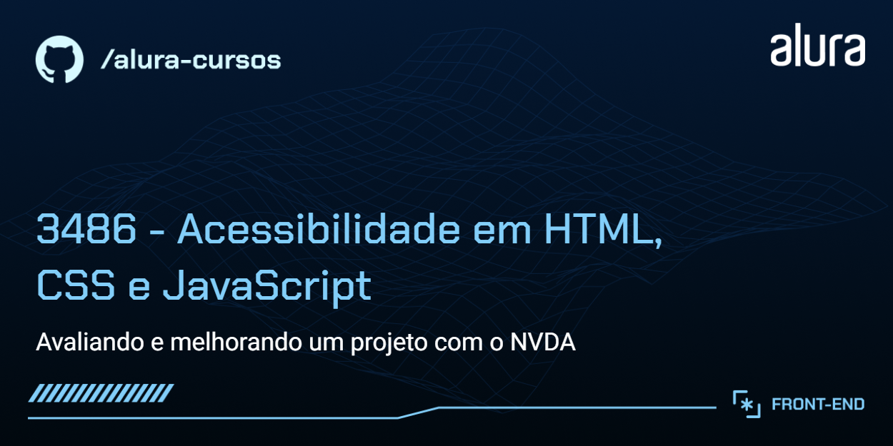

# VidFlow

O VidFlow é uma plataforma de compartilhamento de vídeos.


## 🔨 Funcionalidades do projeto

Atualmente, o projeto base já está pronto: os vídeos são buscados de uma API, possui modo escuro e os botões interativos funcionam.

No entanto, o projeto possui problemas de acessibilidade, e iremos utilizar o NVDA para indetificá-los e corrigi-los.

## ✔️ Técnicas e tecnologias utilizadas

- HTML, CSS e JavaScript
- JSON Server

## Link do Figma

[Acesse o Figma do Vidflow](https://www.figma.com/file/UbPLETdOLAuQk6G09HUtnZ/VidFlow-%7C-Acessibilidade?node-id=0%3A1&mode=dev).

## 🛠️ Abrir e rodar o projeto

Após baixar ou clonar o projeto deste repositório, você precisa ter o [Node.js](https://nodejs.org/) e o [`json-server`](https://www.npmjs.com/package/json-server) instalados.

Caso não tenha o `json-server` instalado globalmente, execute o seguinte comando:

```bash
npm install -g json-server@0.17.4
```

Com o Node.js e o `json-server` instalados, execute o seguinte comando para disponibilizar a API local de vídeos:

```bash
json-server --watch backend/videos.json
```

Em seguida, abra o `index.html` no navegador e o VidFlow já pode ser visualizado!
